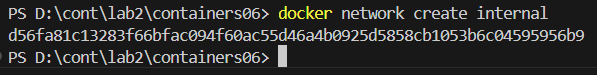
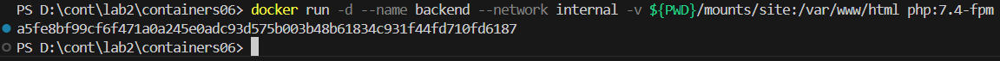
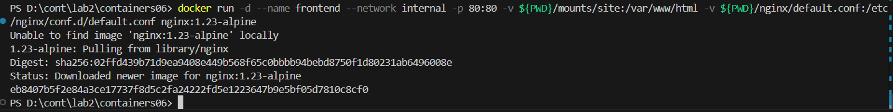
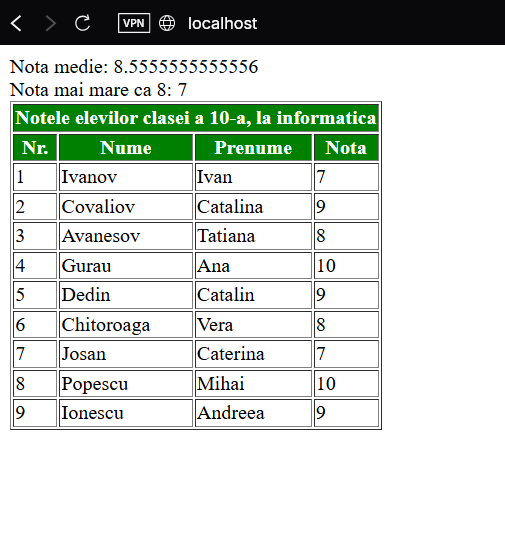

# Numele lucrării de laborator
Interacțiunea containerelor.

# Scopul lucrării
Gestionearea interacțiunilor între mai multe containere.

# Sarcina
Creați o aplicație PHP pe baza a două containere: nginx, php-fpm.

# Efectuarea

## Directorul containers06
- Sa creat directorul containers06 si in el sa creat directorul mounts/site. In acest director am copiat un fisier php de la perechile de php.

## Directorul .gitignore
- Am creat fisierul .gitignore in directorul containers06 cu continutul:
```
# Ignore files and directories
mounts/site/*
```

## In directorul containers06 am creat directorul nginx cu fisierul default.conf cu continutul
```
server {
    listen 80;
    server_name _;
    root /var/www/html;
    index index.php;
    location / {
        try_files $uri $uri/ /index.php?$args;
    }
    location ~ \.php$ {
        fastcgi_pass backend:9000;
        fastcgi_index index.php;
        fastcgi_param SCRIPT_FILENAME $document_root$fastcgi_script_name;
        include fastcgi_params;
    }
}
```

## Sa creat reteau internal
- comanda:
```
docker network create internal
```


## Sa creat containerul backend pe baza la php:7.4-fpm, montarea  mounts/site în /var/www/html, si conectat la reteaua internal:
- comanda:
```
docker run -d --name backend --network internal -v ${PWD}/mounts/site:/var/www/html php:7.4-fpm
```


## Sa creat containerul frontend pe baza la nginx:1.23-alpine, montarea  mounts/site în /var/www/html, conectat la reteaua internal si cu portul 80:80 deschis:
- comanda:
```
docker run -d --name frontend --network internal -p 80:80 -v ${PWD}/mounts/site:/var/www/html -v ${PWD}/nginx/default.conf:/etc/nginx/conf.d/default.conf nginx:1.23-alpine
```


## Accesarea la http://localhost


# Concluzie
Această lucrare de laborator a demonstrat modul în care pot fi utilizate containerele Docker pentru a crea o arhitectură de tip multi-container cu servicii separate: nginx pentru partea de server web și php-fpm pentru procesarea codului PHP. Prin configurarea unei rețele interne și montarea corectă a volumelor, am reușit să asigurăm comunicarea între cele două containere și funcționarea corectă a aplicației PHP.

# Intrebari

## În ce mod în acest exemplu containerele pot interacționa unul cu celălalt?
- Containerele pot interacționa între ele datorită faptului că sunt conectate la aceeași rețea Docker definită de utilizator (internal). În această rețea, containerele se pot adresa unul altuia prin numele containerului ca hostname. De exemplu, nginx poate trimite cereri către php-fpm prin hostname-ul backend.

## Cum văd containerele unul pe celălalt în cadrul rețelei internal?
- În cadrul rețelei internal, fiecare container poate fi accesat de către celelalte prin numele său (numele specificat la crearea containerului). Astfel, în configurația nginx, fastcgi_pass backend:9000; funcționează deoarece backend este numele containerului php-fpm din rețeaua comună.

## De ce a fost necesar să se suprascrie configurarea nginx?
- Configurația implicită a imaginii nginx nu este destinată rulării fișierelor PHP și nu cunoaște cum să redirecționeze cererile către php-fpm. Prin suprascrierea fișierului de configurare (default.conf), am indicat explicit serverului nginx cum să trateze fișierele PHP, cum să le transmită către php-fpm și cum să trateze rutarea paginilor în cadrul aplicației PHP.